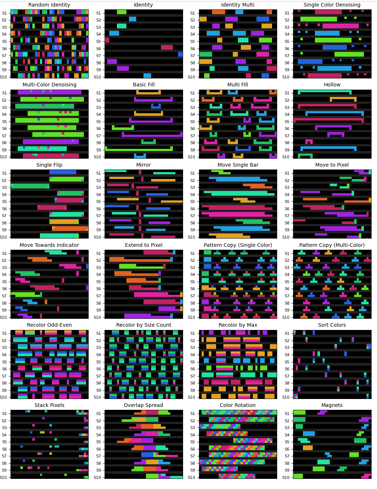

# ARC-like data
<a href="https://x.com/neurallambda">
  
</a>
&nbsp;&nbsp;
<a href="https://discord.gg/HRrPTQn2Uf">
  
</a>
</br></br>

**TL;DR**: generate datasets that require reasoning via the composition of visually intuitive "programs" such as `translation` of blocks of pixels, or identifying block `endpoints`, or `denoising`.

## Examples

Each plot has 10 input-output pairs lined up together.



## Details

The [`neurallambda`](https://github.com/neurallambda/neurallambda) project (also on [**X**](https://x.com/neurallambda/)) aims to develop generic architectures that support **reasoning**. This project requires datasets that demonstrate reasoning, and small toy problems help prove and iterate on the research quickly.

The original [ARC Prize](https://arcprize.org/) dataset contains visual puzzles, but as a benchmark only, therefore not enough data to train on, and some puzzles are prohibitively large.

The `arc-like` repo generates 1D puzzles constructed via composing simple combinator functions, eg:

```python
puzzles = [
    # translate a block by 4 pixels
    ('translate', compose([gen_some_blocks(colors), translate(4)])),

    # identify the endpoints of blocks of pixels
    ('endpoints', compose([gen_some_blocks(colors), endpoints])),

    # compose `translate` and `endpoints`
    ('translate + endpoints', compose([gen_some_blocks(colors),  translate(4), endpoints]))
]
```

A "`combinator`" is very simply a function `Sequence -> Sequence`, which you can see chain together nicely:

```python
@dataclass
class Sequence:
    ''' An input-output pairing, and metadata that might be used by downstream combinators. '''
    inputs: List[Any]
    outputs: List[Any]
    metadata: Any

Combinator = Callable[[Sequence], Sequence]

def translate(n: int) -> Combinator:
    """ Translate the sequence by n positions. """
    def f(seq: Sequence) -> Sequence:
        outputs = seq.outputs
        new_outputs = outputs[-n:] + outputs[:-n]
        return Sequence(seq.inputs, new_outputs, seq.metadata)
    return f
```

Everything's currently in [`puzzles.py`](./arc_like/puzzles.py), no dependencies!:

```sh
git clone https://github.com/neurallambda/arc-like
cd arc-like

# Run the demo (demo only depends on `torch` and `matplotlib`)
python arc_like/puzzles.py

# Use in your code
cd your_code
pip install -e path-to/arc-like
import arc_like.puzzles as puzzles
```

Please add a puzzle as a PR, or, just tell me what you want on [X](https://x.com/neurallambda/)!


## Gratitude

* [`arcticbio`](https://github.com/arcticbio): Thank you for adding a ton of new puzzles, and cleaning up some logic!
* [`rybla`](https://github.com/rybla): Thank you for adding composable combinators, this makes for a much cleaner, more extensible approach!
